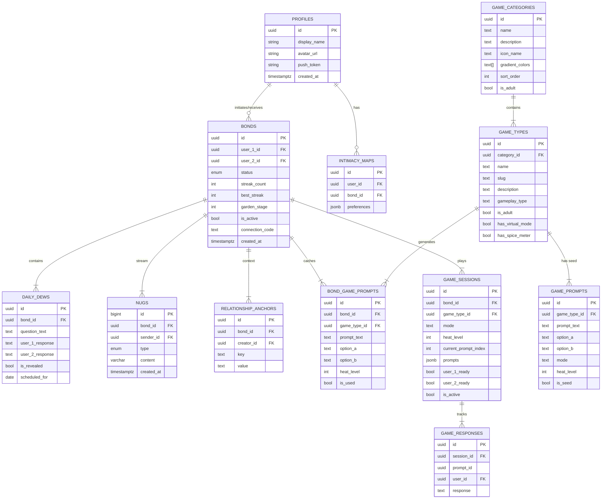

# Mistie: Database Architecture (V2.0)

> **Overview:** PostgreSQL schema optimized for real-time sync, privacy (RLS), and AI context.

## 1. Entity-Relationship Diagram (ERD)



---

## 2. Core Tables

### 2.1 Profiles (`profiles`)
The user identity root.
| Column | Type | Default | Description |
| :--- | :--- | :--- | :--- |
| `id` | `uuid` | - | **PK**. References `auth.users`. |
| `display_name` | `text` | - | Public to partner. |
| `avatar_url` | `text` | `NULL` | Storage path. |
| `push_token` | `text` | `NULL` | Expo Push Token. |
| `created_at` | `timestamptz` | `now()` | Account creation time. |

### 2.2 Bonds (`bonds`)
The single "truth" of the relationship.
| Column | Type | Default | Description |
| :--- | :--- | :--- | :--- |
| `id` | `uuid` | `uuid_v4` | **PK**. |
| `user_1_id` | `uuid` | - | **FK** (Initiator). |
| `user_2_id` | `uuid` | `NULL` | **FK** (Receiver). Null while status='pending'. |
| `status` | `relationship_status` | `'pending'` | `'pending', 'crush', 'couple'`. |
| `streak_count` | `int` | `0` | Consecutive days of activity. |
| `best_streak` | `int` | `0` | Highest streak ever achieved. |
| `garden_stage` | `int` | `1` | Visual maturity level of the garden. |
| `is_active` | `bool` | `true` | Whether the bond is active. |
| `connection_code` | `text` | `NULL` | **UNIQUE**. 6-digit pairing code (null after joined). |
| `created_at` | `timestamptz` | `now()` | Bond creation time. |

### 2.3 Daily Dews (`daily_dews`)
The daily question rituals.
| Column | Type | Default | Description |
| :--- | :--- | :--- | :--- |
| `id` | `uuid` | `uuid_v4` | **PK**. |
| `bond_id` | `uuid` | - | **FK** to `bonds`. |
| `question_text` | `text` | - | AI generated question. |
| `user_1_response` | `text` | `NULL` | NULL until answered. |
| `user_2_response` | `text` | `NULL` | NULL until answered. |
| `is_revealed` | `bool` | `false` | True when BOTH have answered. |
| `scheduled_for` | `date` | - | One per day per bond. |

### 2.4 Nugs (`nugs`)
High-frequency pulses and notes (haptic micro-interactions).
| Column | Type | Default | Description |
| :--- | :--- | :--- | :--- |
| `id` | `bigint` | Auto-increment | **PK**. |
| `bond_id` | `uuid` | - | **FK** to `bonds`. |
| `sender_id` | `uuid` | - | **FK** to `profiles`. |
| `type` | `nug_type` | - | `'silent'` or `'note'`. |
| `content` | `varchar` | `NULL` | Optional text payload (<50 chars). |
| `created_at` | `timestamptz` | `now()` | Timestamp of nug. |

### 2.5 Intimacy Maps (`intimacy_maps`)
User preference system for games/activities.
| Column | Type | Default | Description |
| :--- | :--- | :--- | :--- |
| `id` | `uuid` | `uuid_v4` | **PK**. |
| `user_id` | `uuid` | - | **FK** to `profiles`. **UNIQUE**. |
| `bond_id` | `uuid` | `NULL` | **FK** to `bonds`. |
| `preferences` | `jsonb` | `'{}'` | Preference key-value pairs. |

### 2.6 Relationship Anchors (`relationship_anchors`)
Context for AI personalization (anniversaries, shared memories, etc.).
| Column | Type | Default | Description |
| :--- | :--- | :--- | :--- |
| `id` | `uuid` | `uuid_v4` | **PK**. |
| `bond_id` | `uuid` | - | **FK** to `bonds`. |
| `creator_id` | `uuid` | - | **FK** to `profiles`. |
| `key` | `text` | - | Anchor type (e.g., "anniversary"). |
| `value` | `text` | - | Anchor value (e.g., "2024-02-14"). |

---

## 3. Games Tables (NEW)

### 3.1 Game Categories (`game_categories`)
Parent categories organizing games by theme.
| Column | Type | Default | Description |
| :--- | :--- | :--- | :--- |
| `id` | `uuid` | `uuid_v4` | **PK**. |
| `name` | `text` | - | Category name (e.g., "Little Spice"). |
| `description` | `text` | `NULL` | Brief description. |
| `icon_name` | `text` | `NULL` | Lucide icon name. |
| `gradient_colors` | `text[]` | `NULL` | Array of hex colors for UI. |
| `sort_order` | `int` | `0` | Display order. |
| `is_adult` | `bool` | `false` | True for 18+ content. |
| `created_at` | `timestamptz` | `now()` | Creation timestamp. |

**Categories:**
| Name | Description | Adult? |
|------|-------------|--------|
| Discovery | New explorations and late-night vibes | No |
| As a Couple | Strengthening bond and shared history | No |
| Date Night | Pure entertainment and engaging choices | No |
| Little Spice | Bold, unfiltered intimacy | Yes (18+) |

### 3.2 Game Types (`game_types`)
Individual games within categories.
| Column | Type | Default | Description |
| :--- | :--- | :--- | :--- |
| `id` | `uuid` | `uuid_v4` | **PK**. |
| `category_id` | `uuid` | - | **FK** to `game_categories`. |
| `name` | `text` | - | Game name (e.g., "Would You Rather"). |
| `slug` | `text` | - | **UNIQUE**. URL-safe identifier. |
| `description` | `text` | `NULL` | Brief description. |
| `icon_name` | `text` | `NULL` | Lucide icon name. |
| `gradient_colors` | `text[]` | `NULL` | Array of hex colors. |
| `gameplay_type` | `text` | `'prompt'` | Game mechanic: `prompt`, `choice`, `dare`, `vote`, `quiz`, `debate`, `wildcard`. |
| `is_adult` | `bool` | `false` | 18+ content flag. |
| `has_virtual_mode` | `bool` | `false` | Supports long-distance play. |
| `has_spice_meter` | `bool` | `false` | Has heat level slider. |
| `sort_order` | `int` | `0` | Display order. |
| `created_at` | `timestamptz` | `now()` | Creation timestamp. |

**Games by Category:**
| Category | Game | Gameplay Type | Spice Meter? |
|----------|------|---------------|--------------|
| Discovery | Crush | prompt | No |
| Discovery | Deep Night | prompt | No |
| Discovery | Is it Okay? | debate | No |
| As a Couple | Connected | prompt | No |
| As a Couple | Who's More Likely | vote | No |
| As a Couple | Memory Lane | prompt | No |
| As a Couple | Mirror | quiz | No |
| Date Night | Tell Me Everything | prompt | No |
| Date Night | Between Us | wildcard | No |
| Date Night | Would You Rather | choice | No |
| Little Spice | Would You Rather Hot | choice | ✅ Yes |
| Little Spice | Intimacy | prompt | ✅ Yes |
| Little Spice | Hard-Dare | dare | ✅ Yes |

### 3.3 Game Prompts (`game_prompts`)
Global seed prompts (fallback pool).
| Column | Type | Default | Description |
| :--- | :--- | :--- | :--- |
| `id` | `uuid` | `uuid_v4` | **PK**. |
| `game_type_id` | `uuid` | - | **FK** to `game_types`. |
| `prompt_text` | `text` | - | The prompt/question/dare text. |
| `option_a` | `text` | `NULL` | First option (for choice games). |
| `option_b` | `text` | `NULL` | Second option (for choice games). |
| `mode` | `text` | `'both'` | `'in_person'`, `'virtual'`, or `'both'`. |
| `heat_level` | `int` | `1` | 1=mild, 2=warm, 3=hot, 4=inferno. |
| `is_seed` | `bool` | `true` | True for manually added prompts. |
| `created_at` | `timestamptz` | `now()` | Creation timestamp. |

### 3.4 Bond Game Prompts (`bond_game_prompts`)
AI-generated prompts cached per bond for reuse.
| Column | Type | Default | Description |
| :--- | :--- | :--- | :--- |
| `id` | `uuid` | `uuid_v4` | **PK**. |
| `bond_id` | `uuid` | - | **FK** to `bonds`. |
| `game_type_id` | `uuid` | - | **FK** to `game_types`. |
| `prompt_text` | `text` | - | The prompt/question/dare text. |
| `option_a` | `text` | `NULL` | First option (for choice games). |
| `option_b` | `text` | `NULL` | Second option (for choice games). |
| `mode` | `text` | `'both'` | `'in_person'`, `'virtual'`, or `'both'`. |
| `heat_level` | `int` | `2` | 1=mild, 2=warm, 3=hot, 4=inferno. |
| `is_used` | `bool` | `false` | True after shown to couple. |
| `created_at` | `timestamptz` | `now()` | Generation timestamp. |

**Unique Constraint:** `(bond_id, game_type_id, prompt_text)` - Prevents duplicate prompts per bond.

### 3.5 Game Sessions (`game_sessions`)
Real-time game sessions between partners.
| Column | Type | Default | Description |
| :--- | :--- | :--- | :--- |
| `id` | `uuid` | `uuid_v4` | **PK**. |
| `bond_id` | `uuid` | - | **FK** to `bonds`. |
| `game_type_id` | `uuid` | - | **FK** to `game_types`. |
| `mode` | `text` | `'in_person'` | `'in_person'` or `'virtual'`. |
| `heat_level` | `int` | `2` | Spice level for this session. |
| `current_prompt_index` | `int` | `0` | Current position in prompts array. |
| `prompts` | `jsonb` | `'[]'` | Array of prompt IDs for session. |
| `user_1_ready` | `bool` | `false` | Partner 1 ready for next prompt. |
| `user_2_ready` | `bool` | `false` | Partner 2 ready for next prompt. |
| `user_1_response` | `text` | `NULL` | Current response from partner 1. |
| `user_2_response` | `text` | `NULL` | Current response from partner 2. |
| `started_at` | `timestamptz` | `now()` | Session start time. |
| `ended_at` | `timestamptz` | `NULL` | Session end time. |
| `is_active` | `bool` | `true` | True while session is ongoing. |

### 3.6 Game Responses (`game_responses`)
Historical record of all responses for stats.
| Column | Type | Default | Description |
| :--- | :--- | :--- | :--- |
| `id` | `uuid` | `uuid_v4` | **PK**. |
| `session_id` | `uuid` | - | **FK** to `game_sessions`. |
| `prompt_id` | `uuid` | `NULL` | Reference to the prompt used. |
| `prompt_source` | `text` | `'bond'` | `'seed'` or `'bond'`. |
| `user_id` | `uuid` | - | **FK** to `profiles`. |
| `response` | `text` | `NULL` | The user's answer ('A', 'B', or text). |
| `created_at` | `timestamptz` | `now()` | Response timestamp. |

---

## 4. Security & Row Level Security (RLS)

### 4.1 The "Couples Only" Policy
*   **Rule:** A user can ONLY see rows where `bond_id` matches a bond they are part of.
*   **Implementation (example for daily_dews):**
    ```sql
    CREATE POLICY "Bond members can view dews" ON daily_dews FOR SELECT
    USING (
      auth.uid() IN (
        SELECT user_1_id FROM bonds WHERE id = bond_id
        UNION
        SELECT user_2_id FROM bonds WHERE id = bond_id
      )
    );
    ```

### 4.2 Games RLS Policies
*   `game_categories` & `game_types`: Public read access (game catalog).
*   `game_prompts`: Public read for seed prompts only.
*   `bond_game_prompts`: Couples-only access via bond membership check.
*   `game_sessions`: Couples-only access with full CRUD.
*   `game_responses`: Session participants only.

### 4.3 Privacy Barriers
*   `intimacy_maps`: Strict ownership. Partner `A` cannot query Partner `B`'s distinct map, only the *result* of the intersection function (processed via Edge Function).

---

## 5. Real-time Subscriptions

The following tables have real-time enabled for instant sync:

```sql
ALTER PUBLICATION supabase_realtime ADD TABLE daily_dews;
ALTER PUBLICATION supabase_realtime ADD TABLE nugs;
ALTER PUBLICATION supabase_realtime ADD TABLE game_sessions;
ALTER PUBLICATION supabase_realtime ADD TABLE game_responses;
```

---

## 6. Custom Types & Enums

```sql
CREATE TYPE relationship_status AS ENUM ('pending', 'crush', 'couple');
CREATE TYPE nug_type AS ENUM ('silent', 'note');
CREATE TYPE atmosphere_type AS ENUM ('morning', 'deep', 'aura', 'wildfire');
```

### Heat Level Scale (for Spice Meter)
| Level | Name | Description |
|-------|------|-------------|
| 1 | Mild | Suggestive but tasteful |
| 2 | Warm | Moderate, flirty content |
| 3 | Hot | Explicit, steamy content |
| 4 | Inferno | Uncensored, no limits |

---

## 7. Edge Functions

| Function | Purpose |
|----------|---------|
| `generate-daily-dew` | Create daily questions for bonds |
| `send-push-notification` | Send Expo push notifications |
| `wildfire-generator` | Generate atmosphere/game content |
| `mistie-shredder` | Clean up old/expired data |
| `generate-game-prompts` | **NEW**: Batch generate 50 game prompts per request |

### `generate-game-prompts` Parameters
```typescript
{
  bond_id: string,        // Required: The bond to cache prompts for
  game_type_slug: string, // Required: e.g., "would-you-rather-hot"
  heat_level?: number,    // Optional: 1-4 (default: 2)
  mode?: string,          // Optional: "in_person" or "virtual"
  count?: number          // Optional: Number of prompts (default: 50)
}
```